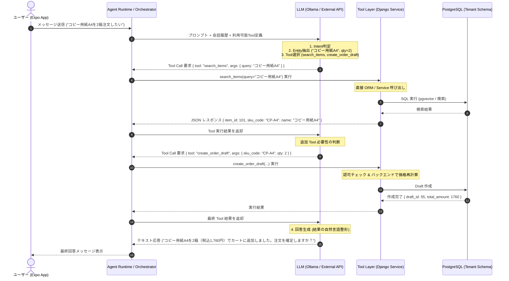
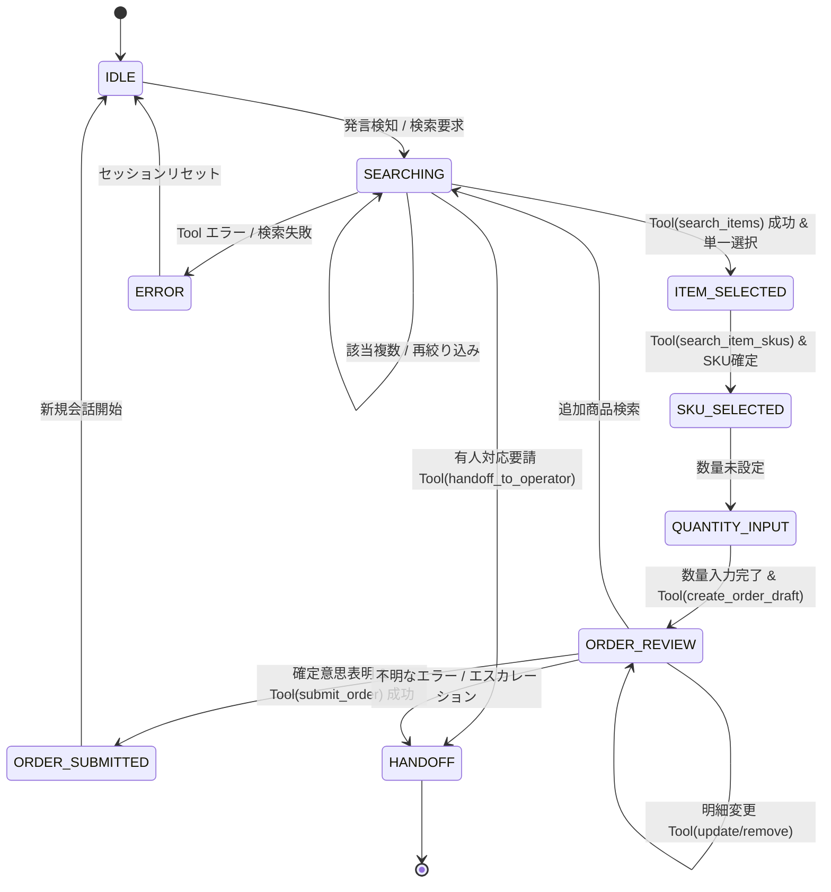

# Expo 会話型注文アプリ 要件定義・基本設計書

> [!IMPORTANT]
> この文書は実装前の仕様確定を目的とした設計書です。実装は別途判断・承認後に着手します。
> 既存コード（`/Users/iris/transbox_v2`）の精査結果をもとに作成しています。

## 1. プロジェクト概要

### 1.1 背景・目的

TRANSBOX v2 の管理者（テナント）向け機能は React/Vite で構築済みであり、カタログ閲覧・注文申請はウェブブラウザ経由で提供されています。本プロジェクトでは、カスタマーのエンドユーザー（CustomerEndUser）が**スマートフォン上で会話形式で商品を探し、注文申請できるモバイルアプリ**を React Native / Expo で別リポジトリとして構築します。

LLM（Ollama 経由の 8B クラス Instruction モデル）と商品ベクトル検索（pgvector + bge-m3）は TRANSBOX バックエンドに既存実装があるため、Expo アプリからバックエンド API 経由で利用します。

### 1.2 対象ユーザー

| ロール | 説明 |
|--------|------|
| `customer_end_user` | カスタマー企業のエンドユーザー。スマートフォンで注文申請する担当者 |
| `customer` / `customer_admin` | カスタマー企業の担当者・管理者（本アプリでは主に閲覧・確認を想定） |

> [!NOTE]
> 本フェーズではエンドユーザーの注文申請（`EndUserOrderRequest`）に集中します。テナント側の承認・注文処理は既存 Web フロントエンドで継続します。

### 1.3 スコープ

**Phase 1（本設計対象）:**
- 認証（JWT ログイン / リフレッシュ）
- カタログ一覧・商品閲覧
- 会話型商品検索（RAG）
- 注文カート・申請（EndUserOrderRequest 作成）
- 申請履歴確認

**Phase 2（将来候補）:**
- プッシュ通知（注文承認・差し戻し）
- 複数カタログ並行管理
- オフライン対応
- 画像ピッカーによる注文

---

## 2. 既存コード調査結果

### 2.1 バックエンド技術スタック

```
Python 3.13 / Django / Django REST Framework
PostgreSQL + django-tenants（スキーマ分離マルチテナント）
pgvector（ベクトル検索）
Ollama（Embedding / Chat LLM ローカル実行）
JWT 自前実装（HS256、アクセストークン30分、リフレッシュトークン12時間）
```

**主要設定値:**
```python
TENANT_AUTH_ACCESS_TOKEN_LIFETIME_SECONDS = 1800   # 30分
TENANT_AUTH_REFRESH_TOKEN_LIFETIME_SECONDS = 43200  # 12時間
OLLAMA_BASE_URL = "http://127.0.0.1:11434"
AI_EMBEDDING_MODEL = "bge-m3"           # 日本語 Embedding
AI_EMBEDDING_DIMENSIONS = 1024          # pgvector 次元数
AI_CHAT_MODEL = "qwen2.5:0.5b"          # チャット LLM（現状設定。8B モデルへ変更予定）
```

### 2.2 テナント解決方式

テナントは以下の優先順で解決されます（`app/platform/auth/context.py`）：

1. `request.tenant`（django-tenants ミドルウェア、ドメイン名で自動解決）
2. `X-Tenant-Schema` HTTP ヘッダー（エスケープハッチ）
3. public fallback（開発時のみ）

モバイルアプリは**ドメイン名で接続すること（`bg-beta.transbox.tech`）が原則**。フォールバックとして `X-Tenant-Schema` ヘッダーを使用可能（開発時）。

### 2.3 認証フロー（既存実装）

```
POST /api/tenant/auth/login/
  Body: { email, password }
  Response: {
    item: TenantAuthUser,
    tokens: {
      access_token,
      refresh_token,
      token_type: "Bearer",
      access_expires_in: 1800,
      refresh_expires_in: 43200
    }
  }

POST /api/tenant/auth/refresh/
  Body: { refresh_token }
  Response: { item, tokens }

GET /api/tenant/auth/me/
  Header: Authorization: Bearer <access_token>
  Response: { item: TenantAuthUser }
```

**JWT クレーム構造（既存）:**
```json
{
  "sub": "user_id",
  "realm": "tenant",
  "tenant_id": "6",
  "schema_name": "tenant_bg_beta",
  "token_type": "access | refresh",
  "iat": ...,
  "exp": ...
}
```

**TenantAuthUser 構造（既存）:**
```typescript
type TenantAuthUser = {
  id: number;
  email: string;
  display_name: string;
  role: string;            // "customer_end_user" など
  is_tenant_admin: boolean;
  is_active: boolean;
  has_customer_link: boolean;
  has_supplier_link: boolean;
  customer_membership: {
    customer_id: number;
    customer_name: string;
    customer_code: string;
    is_primary_contact: boolean;
    is_active: boolean;
  } | null;
  supplier_membership: null;
  terminology: {
    customer: TerminologyResolution;
    supplier: TerminologyResolution;
    item: TerminologyResolution;
  };
};
```

### 2.4 AI アシスタント（既存実装）

既存エンドポイント（認証必要、`TenantJWTAuthentication`）：

```
POST /api/ai-assistant/search/items/
  Body: { query: str, limit: int, min_similarity?: float }
  Response: {
    query, model_name, count,
    results: [{ item_id, item_code, name, brand_name, category_name, similarity, distance }]
  }

POST /api/ai-assistant/rag/items/answer/
  Body: { query: str, search_limit: int, min_similarity?: float }
  Response: {
    query, answer, model_name, answer_mode: "llm"|"fallback",
    source_count, sources: [{ item_id, item_code, name, similarity, distance }]
  }
```

**RAG 安全対策（既存、`app/domains/ai_assistant/rag.py`）:**
- 商品名・商品コード・価格・在庫・納期の出力を禁止するプロンプトエンジニアリング
- 禁止ワード静的検知 + 動的検知（商品名マッチング）
- 違反時はフォールバック文言 + Django 生成の商品リストを使用
- プロンプトインジェクション対策（ユーザー入力の上書き指示を無視するルール）

**Embedding モデル（既存）:**
- `bge-m3` （1024 次元）: 日本語に適した多言語 Embedding モデル
- pgvector の cosine distance で類似度計算
- `min_similarity` は cosine 類似度（1 - distance）のしきい値

### 2.5 注文関連モデル（既存実装）

```python
# app/domains/ordering/models.py

class EndUserOrderRequest:
  customer: FK(Customer)
  end_user: FK(CustomerEndUser, nullable=True)  # null = 自己注文
  catalog: FK(Catalog)
  sales_mode: str
  request_number: str (unique, nullable → 採番後に設定)
  status: "draft|submitted|approved|rejected|on_hold|canceled"
  total_quantity: int
  total_amount: Decimal (nullable)
  idempotency_key: UUID (nullable)
  # 一意制約: customer + idempotency_key (not null の場合のみ)

class EndUserOrderRequestLine:
  request: FK(EndUserOrderRequest)
  item_id: int (nullable)
  sku_id: int (nullable)
  sku_code: str
  jan_code: str
  item_name_snapshot: str
  sku_name_snapshot: str
  unit_price_snapshot: Decimal (nullable)
  quantity: int
  line_amount: Decimal (nullable)
```

### 2.6 カタログモデル（既存実装）

```python
# app/domains/catalog_core/models.py

class Catalog:
  name, code
  catalog_type: "paper|digital"
  sales_mode: "normal|preorder|pre_order_intake"
  starts_at, ends_at (nullable)
  status: "draft|active|archived"
  is_active: bool

class CatalogItemListing:
  catalog: FK(Catalog)
  item: FK(Item)
  is_listed: bool
  display_order: int
  title_override, description_override, spec_override (nullable)
  selected_image_ids: JSON

class CatalogSkuListing:
  catalog_item_listing: FK(CatalogItemListing)
  item_sku: FK(ItemSku)
  is_listed: bool
  price_override: Decimal (nullable)
  name_override (nullable)
  order_number: str
  selected_image_ids: JSON
```

### 2.7 エンドユーザーロール（既存実装）

```python
# app/domains/tenant_identity/roles.py
CUSTOMER_END_USER = "customer_end_user"   # モバイルアプリの主対象ロール
CUSTOMER = "customer"
CUSTOMER_ADMIN = "customer_admin"
```

---

## 3. アーキテクチャ設計

### 3.1 接続構成

```
┌─────────────────┐     HTTPS     ┌─────────────────────────────┐
│   Expo アプリ    │──────────────▶│  bg-beta.transbox.tech       │
│                 │               │  (Nginx → Django backend)    │
│  iOS / Android  │               │                             │
└─────────────────┘               │  /api/tenant/auth/          │
                                  │  /api/ai-assistant/         │
                                  │  /api/end-user/             │
                                  │  /api/catalogs/             │
                                  │                             │
                                  │  ┌──────────────────────┐  │
                                  │  │ Ollama (localhost)   │  │
                                  │  │  bge-m3 (embedding)  │  │
                                  │  │  llama3:8b (chat)    │  │
                                  │  └──────────────────────┘  │
                                  └─────────────────────────────┘
```

### 3.2 Expo アプリ構成案

```
src/
  app/                    # Expo Router v3 ベースのルーティング
    _layout.tsx           # ルートレイアウト（認証ガード）
    (auth)/
      _layout.tsx
      login.tsx           # ログイン画面
    (app)/
      _layout.tsx         # タブナビゲーション
      index.tsx           # ホーム（カタログ一覧）
      catalogs/
        _layout.tsx
        [id]/
          index.tsx       # カタログ詳細・商品一覧
          items/
            [itemId].tsx  # 商品詳細・SKU 選択
          chat.tsx        # 会話型検索
      cart/
        index.tsx         # カート確認
        confirm.tsx       # 注文確認
        complete.tsx      # 申請完了
      orders/
        index.tsx         # 申請履歴
        [requestId].tsx   # 申請詳細
      profile/
        index.tsx         # プロフィール・ログアウト

  api/
    client.ts             # axios ラッパー（JWT 付与・リフレッシュインターセプター）
    auth.ts
    catalogs.ts
    items.ts
    orders.ts
    aiAssistant.ts

  stores/
    auth.ts               # Zustand（認証状態・ユーザー情報）
    cart.ts               # Zustand（カート状態）
    chat.ts               # Zustand（会話履歴、メモリのみ）

  components/
    ui/                   # 共通 UI コンポーネント
    catalog/
      CatalogCard.tsx
      ItemCard.tsx
      SkuSelector.tsx
    chat/
      ChatBubble.tsx
      ChatInput.tsx
      ItemSuggestionCard.tsx
    cart/
      CartItem.tsx
      CartSummary.tsx

  types/
    api.ts
    auth.ts
    catalog.ts
    order.ts
    chat.ts

  hooks/
    useAuth.ts
    useCart.ts
    useChatMessages.ts
    useTokenRefresh.ts
```

### 3.3 技術スタック（推奨）

| 領域 | 採用候補 | 選定理由 |
|------|----------|---------|
| フレームワーク | Expo SDK 51 + React Native | 指定要件 |
| ルーティング | Expo Router v3 | ファイルベース、型安全 |
| 状態管理 | Zustand | 軽量、TypeScript との相性良好 |
| HTTP クライアント | Axios | インターセプターで JWT 自動付与・リフレッシュが実装しやすい |
| トークン保存 | expo-secure-store | iOS Keychain / Android Keystore（平文保存を避ける） |
| UI コンポーネント | React Native Paper | Material Design、日本語対応良好 |
| 言語 | TypeScript | 既存フロントエンドと統一 |
| フォーム | react-hook-form | 既存 Web フロントと同様 |
| 国際化 | i18next + react-i18next | 既存の i18n 方針と整合 |

---

## 4. 認証設計

### 4.1 ログインフロー

```typescript
// api/auth.ts
export async function login(email: string, password: string) {
  const response = await apiClient.post("/api/tenant/auth/login/", {
    email,
    password,
  });
  const { access_token, refresh_token } = response.data.tokens;
  await SecureStore.setItemAsync("access_token", access_token);
  await SecureStore.setItemAsync("refresh_token", refresh_token);
  return response.data.item;  // TenantAuthUser
}
```

### 4.2 Axios インターセプター（JWT 自動付与・リフレッシュ）

```typescript
// api/client.ts
const apiClient = axios.create({
  baseURL: process.env.EXPO_PUBLIC_API_BASE_URL,
  timeout: 30000,
});

// リクエストインターセプター: アクセストークン付与
apiClient.interceptors.request.use(async (config) => {
  const token = await SecureStore.getItemAsync("access_token");
  if (token) {
    config.headers.Authorization = `Bearer ${token}`;
  }
  return config;
});

// レスポンスインターセプター: 401 → リフレッシュ → リトライ
apiClient.interceptors.response.use(
  (response) => response,
  async (error) => {
    if (error.response?.status === 401 && !error.config._retry) {
      error.config._retry = true;
      try {
        const refreshToken = await SecureStore.getItemAsync("refresh_token");
        const { data } = await axios.post(
          `${process.env.EXPO_PUBLIC_API_BASE_URL}/api/tenant/auth/refresh/`,
          { refresh_token: refreshToken }
        );
        await SecureStore.setItemAsync("access_token", data.tokens.access_token);
        error.config.headers.Authorization = `Bearer ${data.tokens.access_token}`;
        return apiClient(error.config);
      } catch {
        // リフレッシュ失敗 → ログアウト
        await logout();
        router.replace("/(auth)/login");
      }
    }
    return Promise.reject(error);
  }
);
```

### 4.3 テナント接続設定

```bash
# .env
EXPO_PUBLIC_API_BASE_URL=https://bg-beta.transbox.tech

# 開発時（テナントスキーマヘッダー使用）
EXPO_PUBLIC_TENANT_SCHEMA=tenant_bg_beta  # デバッグ用、X-Tenant-Schema ヘッダーに使用
```

---

## 5. 会話型商品検索設計

### 5.1 UI フロー

```
カタログ詳細画面
  │
  └─ [🤖 AIアシスタントに聞く] ボタン
       │
       ↓
  チャット画面 (catalogs/[id]/chat.tsx)
  ┌─────────────────────────────────┐
  │ 🤖 どのような商品をお探しですか？  │
  │    キーワードで教えてください。   │
  │                                 │
  │  👤 プリンタ用紙 A4              │
  │                                 │
  │  🤖 用紙類に関するご質問ですね。  │
  │     以下の商品が候補です。        │
  │                                 │
  │  ┌────────────── 商品カード ────┐ │
  │  │ コピー用紙 A4 500枚        │ │
  │  │ (SKU: CP-A4-500)          │ │
  │  │ 類似度: 0.92              │ │
  │  │ [カートに追加] [詳細を見る] │ │
  │  └───────────────────────────┘ │
  └─────────────────────────────────┘
  [テキスト入力フィールド] [送信]
```

### 5.2 会話状態管理

```typescript
// stores/chat.ts
type ChatMessage = {
  id: string;
  role: "user" | "assistant";
  content: string;
  sources?: ItemSource[];  // RAG ソース（商品カード表示用）
  answer_mode?: "llm" | "fallback";
  timestamp: Date;
  isLoading?: boolean;
};

type ItemSource = {
  item_id: number;
  item_code: string;
  name: string;
  similarity: number;
  distance: number;
};

type ChatStore = {
  messages: ChatMessage[];
  isLoading: boolean;
  addUserMessage: (content: string) => void;
  addAssistantMessage: (content: string, sources: ItemSource[], answer_mode: string) => void;
  setLoading: (loading: boolean) => void;
  clear: () => void;
};
```

> [!NOTE]
> 会話履歴はバックエンドには保存せず、クライアントのメモリ（Zustand）のみで管理します。アプリ再起動時にリセットされます。Phase 2 以降でバックエンド永続化を検討します。

### 5.3 RAG API 呼び出し

```typescript
// api/aiAssistant.ts
export async function getRagAnswer(query: string, catalogId?: number) {
  const response = await apiClient.post("/api/ai-assistant/rag/items/answer/", {
    query,
    search_limit: 5,
    min_similarity: 0.3,
    // catalog_id: catalogId,  // ← バックエンド対応後に追加
  });
  return response.data;  // { answer, sources, answer_mode }
}
```

### 5.4 カタログスコープ（重要課題）

現状の RAG API は `is_active=True` の**全商品**を対象としています。モバイルアプリでは**閲覧中のカタログに掲載された商品のみ**を対象にすべきです。

**バックエンドの対応が必要：**
```python
# 追加が必要: catalog_id パラメータによるフィルタリング
item_queryset = Item.objects.filter(
    is_active=True,
    catalog_listings__catalog_id=catalog_id,  # カタログスコープ
    catalog_listings__is_listed=True,
)
```

---

## 6. カタログ・商品閲覧設計

### 6.1 API エンドポイント

```
GET /api/end-user/catalogs/           # エンドユーザー向けカタログ一覧（確認要）
GET /api/catalogs/                    # テナント向け（権限により使用可否要確認）
GET /api/catalogs/:id/               # カタログ詳細
GET /api/catalogs/:id/items/:item_id/skus/  # SKU 一覧（価格含む）
```

### 6.2 商品表示ルール

| 表示項目 | データソース | 優先順位 |
|---------|-------------|---------|
| 商品名 | `CatalogItemListing.title_override` → `Item.name` | override 優先 |
| SKU 名 | `CatalogSkuListing.name_override` → `ItemSku.name` | override 優先 |
| 価格 | `CatalogSkuListing.price_override` → `ItemSkuPrice.amount` | override 優先 |
| 画像 | `CatalogSkuListing.selected_image_ids` → TenantAsset URL | |
| SKU コード | `ItemSku.code` | |
| JAN コード | `ItemSku.jan_code` | |

> [!NOTE]
> 価格は「参考価格」として表示し「確定価格はご確認ください」という UI ラベルを付けること（バックエンドで再計算されるため）。

---

## 7. カート・注文申請設計

### 7.1 カート状態管理

```typescript
// stores/cart.ts
type CartItem = {
  catalog_id: number;
  catalog_item_listing_id: number;
  item_id: number;
  sku_id: number;
  sku_code: string;
  jan_code: string;
  item_name_snapshot: string;
  sku_name_snapshot: string;
  unit_price_snapshot: number | null;  // 表示用のみ（バックエンドで再計算）
  quantity: number;
};

type CartStore = {
  items: CartItem[];
  note: string;
  catalogId: number | null;
  addItem: (item: CartItem) => void;
  removeItem: (skuId: number) => void;
  updateQuantity: (skuId: number, quantity: number) => void;
  setNote: (note: string) => void;
  clear: () => void;
};
```

### 7.2 注文申請フロー

```typescript
// api/orders.ts
export async function submitOrderRequest(
  catalogId: number,
  lines: CartItem[],
  note: string,
  idempotencyKey: string
) {
  const response = await apiClient.post(
    `/api/end-user/catalogs/${catalogId}/requests/`,
    {
      lines: lines.map((item) => ({
        sku_id: item.sku_id,
        quantity: item.quantity,
      })),
      note,
      idempotency_key: idempotencyKey,
    }
  );
  return response.data;
}
```

### 7.3 冪等性制御

```typescript
// hooks/useOrderIdempotency.ts
const IDEMPOTENCY_KEY_PREFIX = "transbox:end-user-order";

export async function getOrCreateIdempotencyKey(
  userId: number,
  catalogId: number
): Promise<string> {
  const storageKey = `${IDEMPOTENCY_KEY_PREFIX}:${userId}:${catalogId}:idempotency-key`;
  const existing = await SecureStore.getItemAsync(storageKey);
  if (existing) return existing;

  const newKey = generateUUIDv4();
  await SecureStore.setItemAsync(storageKey, newKey);
  return newKey;
}

export async function clearIdempotencyKey(
  userId: number,
  catalogId: number
): Promise<void> {
  const storageKey = `${IDEMPOTENCY_KEY_PREFIX}:${userId}:${catalogId}:idempotency-key`;
  await SecureStore.deleteItemAsync(storageKey);
}
```

---

## 8. 画面一覧

| 画面名 | ルート | 主な機能 |
|--------|--------|---------|
| ログイン | `/(auth)/login` | メール・パスワード認証、エラー表示 |
| ホーム | `/(app)/` | アクティブなカタログ一覧 |
| カタログ詳細 | `/(app)/catalogs/[id]` | 商品一覧、AIチャット開始ボタン |
| AIチャット | `/(app)/catalogs/[id]/chat` | 会話型商品検索、商品カード、カート追加 |
| 商品詳細 | `/(app)/catalogs/[id]/items/[itemId]` | SKU 選択、数量入力、カート追加 |
| カート | `/(app)/cart` | 数量調整、削除、注文メモ、合計金額 |
| 注文確認 | `/(app)/cart/confirm` | 最終確認、申請ボタン |
| 申請完了 | `/(app)/cart/complete` | 申請番号表示、ホームへ戻る |
| 申請履歴 | `/(app)/orders` | 申請一覧（ステータス別） |
| 申請詳細 | `/(app)/orders/[requestId]` | ステータス・明細・レビューメモ |
| プロフィール | `/(app)/profile` | ユーザー情報表示、ログアウト |

---

## 9. セキュリティ設計

### 9.1 トークン管理

| 項目 | 方針 |
|------|------|
| 保存場所 | `expo-secure-store`（iOS Keychain / Android Keystore） |
| アクセストークン有効期限 | 30 分（既存バックエンド設定に準拠） |
| リフレッシュトークン有効期限 | 12 時間（既存バックエンド設定に準拠） |
| 自動リフレッシュ | Axios インターセプター（401 検知 → refresh → retry） |
| ログアウト | 両トークンを SecureStore から削除 |
| 非アクティブタイムアウト | アプリレベルのタイムアウト（任意、30 分以上の非操作でログアウト促進） |

### 9.2 プロンプトインジェクション対策

- ユーザー入力文字数制限: 500 文字（バックエンドと同じ制約）
- 入力フィールドに改行入力を制限
- バックエンドの既存対策（FORBIDDEN_LLM_PATTERNS + フォールバック）が動作

### 9.3 価格・在庫情報の表示方針

- 価格は「参考価格」として UI に明示（バックエンドで再計算されるため）
- 在庫・納期情報は表示しない（RAG の禁止ルールとも整合）
- `has_price_missing=True` の場合は「価格未確定」の UI 表示

---

## 10. API 設計整理

### 10.1 既存 API で対応できるもの

| 機能 | エンドポイント | 状態 |
|------|---------------|------|
| ログイン | `POST /api/tenant/auth/login/` | 完全対応済み |
| リフレッシュ | `POST /api/tenant/auth/refresh/` | 完全対応済み |
| ユーザー情報取得 | `GET /api/tenant/auth/me/` | 完全対応済み |
| セマンティック検索 | `POST /api/ai-assistant/search/items/` | 対応済み（カタログスコープ除く） |
| RAG 回答 | `POST /api/ai-assistant/rag/items/answer/` | 対応済み（カタログスコープ除く） |

### 10.2 確認・新規追加が必要なもの

| 機能 | エンドポイント候補 | 対応方針 |
|------|------------------|---------|
| エンドユーザー向けカタログ一覧 | `GET /api/end-user/catalogs/` | `end_user_urls.py` 確認後に判断 |
| カタログ商品一覧（エンドユーザー） | `GET /api/end-user/catalogs/:id/items/` | 同上 |
| 注文申請作成 | `POST /api/end-user/catalogs/:id/requests/` | 同上 |
| 申請履歴一覧 | `GET /api/end-user/orders/requests/` | 同上 |
| 申請詳細 | `GET /api/end-user/orders/requests/:id/` | 同上 |
| カタログスコープ RAG | `POST /api/ai-assistant/rag/items/answer/` | `catalog_id` パラメータ追加 |

---

## 11. オープン課題・確認事項

> [!IMPORTANT]
> 実装着手前に以下を確認・決定してください。

| # | 確認事項 | 影響範囲 | 優先度 |
|---|---------|---------|-------|
| 1 | `/api/end-user/` 配下の既存エンドポイントの完全リスト | 注文申請 API 設計 | 高 |
| 2 | `customer_end_user` ロールのカタログアクセス権限詳細 | 認可設計 | 高 |
| 3 | カタログスコープ RAG のバックエンド対応方針 | AI 検索設計 | 高 |
| 4 | モバイルアプリのリポジトリ（`/amaranthus/qzbx/` が対象か） | プロジェクト構造 | 高 |
| 5 | LLM モデル変更タイミング（`qwen2.5:0.5b` → `llama3:8b`） | AI 品質 | 中 |
| 6 | UI ライブラリの選定（React Native Paper / NativeWind / Tamagui） | フロント実装 | 中 |
| 7 | `sales_mode` 別の注文フロー分岐をモバイルでどう扱うか | 注文設計 | 中 |
| 8 | 会話履歴の永続化要否（Phase 1 はメモリのみで十分か） | バックエンド設計 | 低 |
| 9 | プッシュ通知の Phase 1 スコープへの包含 | 通知設計 | 低 |
| 10 | テナント接続方式（シングルテナント固定 vs マルチテナント選択） | 認証設計 | 低 |

---

## 12. 実装フェーズ案

| フェーズ | 内容 | 優先度 |
|---------|------|-------|
| **Phase 1-A** | プロジェクト初期化・ルーティング・認証フロー | 高 |
| **Phase 1-B** | カタログ一覧・商品閲覧 | 高 |
| **Phase 1-C** | 会話型商品検索（RAG 連携） | 高 |
| **Phase 1-D** | カート・注文申請 | 高 |
| **Phase 1-E** | 申請履歴 | 中 |
| Phase 2-A | カタログスコープ RAG（バックエンド修正） | 中 |
| Phase 2-B | プッシュ通知 | 低 |
| Phase 2-C | オフライン対応 | 低 |

---

## 13. 参照コード

| ファイル | 説明 |
|---------|------|
| [tenant_jwt.py](file:///Users/iris/transbox_v2/backend/app/platform/auth/tenant_jwt.py) | JWT 発行・検証の実装（クレーム構造） |
| [tenant_auth views.py](file:///Users/iris/transbox_v2/backend/app/features/tenant_auth/views.py) | ログイン・リフレッシュ・me API |
| [auth/context.py](file:///Users/iris/transbox_v2/backend/app/platform/auth/context.py) | テナント解決ロジック（X-Tenant-Schema ヘッダー含む） |
| [tenant-auth-api.ts](file:///Users/iris/transbox_v2/frontend/src/features/tenant-auth/api/tenant-auth-api.ts) | Web フロントエンドの認証 API クライアント（実装参照） |
| [rag.py](file:///Users/iris/transbox_v2/backend/app/domains/ai_assistant/rag.py) | RAG 実装（プロンプト・安全対策） |
| [ollama.py](file:///Users/iris/transbox_v2/backend/app/domains/ai_assistant/ollama.py) | Ollama 通信クライアント |
| [search.py](file:///Users/iris/transbox_v2/backend/app/domains/ai_assistant/search.py) | pgvector セマンティック検索 |
| [ai_assistant views.py](file:///Users/iris/transbox_v2/backend/app/features/ai_assistant/views.py) | AI アシスタント API ビュー |
| [ordering models.py](file:///Users/iris/transbox_v2/backend/app/domains/ordering/models.py) | 注文・申請モデル（EndUserOrderRequest） |
| [party models.py](file:///Users/iris/transbox_v2/backend/app/domains/party/models.py) | Customer / CustomerEndUser モデル |
| [roles.py](file:///Users/iris/transbox_v2/backend/app/domains/tenant_identity/roles.py) | ロール定義 |
| [catalog_core models.py](file:///Users/iris/transbox_v2/backend/app/domains/catalog_core/models.py) | Catalog / CatalogItemListing / CatalogSkuListing |
| [settings/base.py](file:///Users/iris/transbox_v2/backend/app/config/settings/base.py) | 全設定値（Ollama・JWT・AI） |
| [customer_direct_ordering_spec.md](file:///Users/iris/transbox_v2/docs/md/notes/customer_direct_ordering_spec.md) | カスタマー自己注文の既存仕様（注文フロー参照） |

---

## 14. 更新履歴

| 日付 | 内容 |
|------|------|
| 2026-08-01 | 初版作成（既存コード精査に基づく要件定義・基本設計） |

---

# 🚀 AI Agent 化を見据えた拡張設計仕様 (Agentic Extension)

> [!NOTE]
> 以下の 15 章〜 23 章は、既存の RAG ベースの会話設計を拡張し、将来的に Tool Calling / MCP (Model Context Protocol) を利用した自律型 AI Agent へ進化させるための拡張設計仕様です。

---

## 15. AI Agent アーキテクチャ

### 15.1 開発思想と責任境界
本システムの LLM はビジネスロジックや計算ロジック、データ永続化の直接権限を持ちません。LLM の役割を以下の 4 点に限定します。

1. **Intent 判定**: ユーザー発言から意図（商品検索、在庫確認、カート操作、注文確定等）を分類
2. **Entity 抽出**: 発言内から必要なパラメータ（商品名、数量、SKUコード、カタログID等）を抽出
3. **Tool 選択**: 意図に応じた Tool（Django Service API）の選択および引数の生成
4. **回答生成**: Tool の実行結果（JSON）を受け取り、自然な日本語テキストへ整形して応答

価格計算・在庫確認・SKU検索・注文登録・注文確定・顧客情報取得・配送先取得などの業務ロジックは**必ずバックエンドの Tool 経由で実行**します。
また、**AI / LLM が直接 Django ORM や DB へアクセスすることは一切禁止**します。

### 15.2 AI Agent 実行フロー（シーケンス図）



---

## 16. Tool Layer

AI Agent が利用可能な Tool 群の一覧と仕様定義です。すべての Tool はマルチテナント境界（`tenant_id` / `schema_name`）およびユーザー認可を厳格に保持して実行されます。

| Tool 名 | 目的 | 入力 (Args) | 出力 (Returns) | 認可 | テナント境界 | 実装先 (Django Service) | 既存 API 流用可否 |
|---------|------|------------|----------------|------|------------|------------------------|------------------|
| `search_catalogs` | カタログ一覧の検索 | `query?: str, status?: str` | `catalogs: list` | CustomerEndUser | 適用 (Schema) | `catalog_core.services` | 可 (`/api/catalogs/`) |
| `search_items` | カタログ内商品の検索 | `catalog_id: int, query: str, limit?: int` | `items: list` | CustomerEndUser | 適用 (Schema) | `ai_assistant.search` | 可 (`/api/ai-assistant/search/items/`) |
| `search_item_skus` | 特定商品のSKU/バリエーション検索 | `item_id: int` | `skus: list` | CustomerEndUser | 適用 (Schema) | `item.services` | 可 (`/api/item-skus/`) |
| `get_item_detail` | 商品・SKU詳細情報取得 | `item_id: int` | `item_detail: dict` | CustomerEndUser | 適用 (Schema) | `item.services` | 可 (`/api/items/:id/`) |
| `get_item_images` | 商品・SKU画像アセット取得 | `item_id: int, sku_id?: int` | `image_urls: list` | CustomerEndUser | 適用 (Schema) | `asset.services` | 可 (`/api/dam/assets/`) |
| `get_customer` | ログイン中カスタマー情報取得 | なし (Context参照) | `customer_info: dict` | CustomerEndUser | 適用 (Schema) | `party.services` | 可 (`/api/tenant/auth/me/`) |
| `get_customer_price` | 特定SKUの適用顧客価格計算 | `sku_id: int, quantity: int` | `unit_price: Decimal, total: Decimal` | CustomerEndUser | 適用 (Schema) | `pricing.services` | 可 (`/api/catalog-pricing/`) |
| `get_inventory` | 特定SKUの引当可能在庫数照会 | `sku_id: int` | `available_qty: int` | CustomerEndUser | 適用 (Schema) | `inventory.services` | 修正追加必要 |
| `get_catalog_price` | カタログ上書き価格照会 | `catalog_id: int, sku_id: int` | `catalog_price: Decimal` | CustomerEndUser | 適用 (Schema) | `catalog_core.services` | 可 (`/api/catalogs/`) |
| `create_order_draft` | 注文ドラフト/カート作成 | `catalog_id: int, lines: list` | `draft_id: int, total_amount: Decimal` | CustomerEndUser | 適用 (Schema) | `ordering.services` | 可 (`/api/order-drafts/`) |
| `update_order_draft` | カート内明細の数量更新 | `draft_id: int, sku_id: int, quantity: int` | `updated_draft: dict` | CustomerEndUser | 適用 (Schema) | `ordering.services` | 可 (`/api/order-drafts/`) |
| `remove_order_line` | カート内明細の削除 | `draft_id: int, sku_id: int` | `updated_draft: dict` | CustomerEndUser | 適用 (Schema) | `ordering.services` | 可 (`/api/order-drafts/`) |
| `confirm_order` | 注文申請前の事前検証 | `draft_id: int` | `validation_result: dict, totals: dict` | CustomerEndUser | 適用 (Schema) | `ordering.services` | 新規作成 |
| `submit_order` | 正式注文申請の確定作成 | `catalog_id: int, lines: list, note: str, idempotency_key: str` | `request_number: str, status: str` | CustomerEndUser | 適用 (Schema) | `ordering.services` | 可 (`/api/end-user/catalogs/:id/requests/`) |
| `get_order_history` | 過去注文申請履歴の参照 | `status?: str, limit?: int` | `order_requests: list` | CustomerEndUser | 適用 (Schema) | `ordering.services` | 可 (`/api/end-user/orders/requests/`) |
| `get_order_detail` | 注文申請詳細の参照 | `request_id: int` | `request_detail: dict` | CustomerEndUser | 適用 (Schema) | `ordering.services` | 可 (`/api/end-user/orders/requests/:id/`) |
| `handoff_to_operator` | 有人オペレーターへのハンドオフ | `reason: str, context_summary: str` | `handoff_status: str, ticket_id: str` | CustomerEndUser | 適用 (Schema) | `tenant_support.services` | 可 (`/api/tenant/support/`) |

---

## 17. Conversation State（会話状態遷移）

### 17.1 ステートマシン定義
対話セッションは明示的なステートマシンによって制御されます。**LLM 自身には状態を変更する直接権限を与えず**、Tool の実行結果および Agent コントローラーによって状態が決定・更新されます。



### 17.2 状態一覧

- `IDLE`: 初期待機状態
- `SEARCHING`: カタログ・商品・SKUの検索および絞り込み中
- `ITEM_SELECTED`: 商品原本（Item）が決定した状態
- `SKU_SELECTED`: 特定のバリエーション（SKU）が決定した状態
- `QUANTITY_INPUT`: 発注数量の入力・確認待ち状態
- `ORDER_REVIEW`: カート・ドラフト注文内容の最終確認中
- `ORDER_SUBMITTED`: `EndUserOrderRequest` 申請処理の完了状態
- `HANDOFF`: AIでの解決が困難なため有人オペレーターへハンドオフされた状態
- `ERROR`: システムエラーまたは例外からのリカバリ中

---

## 18. AI Memory 設計（短期・長期メモリ）

### 18.1 短期メモリ (Short-term Memory)
- **スコープ**: 単一対話セッション（セッション中メモリ / Client State）
- **保持内容**:
  - 現在選択中の商品 (`item_id`, `item_name`)
  - 現在選択中の SKU (`sku_id`, `sku_code`)
  - 指定された数量 (`quantity`)
  - 現在のダイアログ Intent
  - 最新の Tool 実行結果キャッシュ
- **生存期間**: アプリ再起動、手動リセット、または注文完了時まで

### 18.2 長期メモリ (Long-term Memory)
- **スコープ**: テナント単位・ユーザー単位の永続ストレージ (PostgreSQL / Vector Index)
- **保持内容**:
  - 過去の会話履歴・対話ログ
  - 過去の購入・申請履歴 (`EndUserOrderRequest`)
  - 過去の問い合わせチケット
  - お気に入り・リピート注文商品リスト
  - ユーザー固有の購買傾向 Embedding
- **マルチテナント隔離**: 長期メモリは必ず `tenant_id` / `schema_name` のメタデータタグを付与し、DB レベルで完全に隔絶します。

---

## 19. Embedding 設計の拡張とハイブリッド検索

### 19.1 拡張 Embedding 対象候補
商品原本のみならず、以下のドメインアセットを Vector DB (pgvector) に Embedding インデックス化します。

1. **商品 SKU**: 色・サイズ・個装・型番ごとの個別テキスト
2. **FAQ / ナレッジ**: 注文条件・配送ルール・返品規定の Q&A
3. **ブランド・カテゴリ**: ブランドコンセプト・分類定義
4. **PDF / マニュアル**: 商品仕様書、カタログ PDF から抽出したテキスト
5. **営業資料 / パンフレット**: 商品アピールポイント・用途例
6. **問い合わせ履歴**: 過去の解決済みカスタマーサポート履歴
7. **メディア記述**: 画像キャプション、動画解説スクリプトテキスト

### 19.2 ハイブリッド検索アーキテクチャ (Hybrid Search)
単一のベクトル検索の弱点（型番や正確なJANコード検索の苦手さ）を克服するため、4 方式を組み合わせたハイブリッドスコアリングを導入します。

```
検索クエリ
   │
   ├─► 1. 完全一致 (Exact Match): JANコード, SKUコード, ID
   ├─► 2. 前方一致 (Prefix Match): 型番, 商品コード前置詞
   ├─► 3. 全文検索 (Full-Text Search / BM25): pg_trgm N-gram 検索
   └─► 4. ベクトル検索 (Vector Search): pgvector (bge-m3 Cosine Similarity)
   │
   ▼
[ Reciprocal Rank Fusion (RRF) / スコア統合エンジン ]
   │
   ▼
上位 RERANK 検索結果
```

---

## 20. MCP (Model Context Protocol) 対応設計

### 20.1 アーキテクチャの進化
Anthropic が提唱する標準プロトコル **MCP (Model Context Protocol)** に対応し、Agent Runtime と Tool 層を標準化された JSON-RPC インターフェースで分離します。

```
【現在 (Phase 1: RAG)】
Expo App ──▶ TRANSBOX API ──▶ Django Service ──▶ Ollama

【将来 (Phase 4: MCP Agent)】
Expo App ──▶ TRANSBOX API ──▶ Agent Runtime (Orchestrator)
                                     │
                                     ├──(MCP Protocol / JSON-RPC)──▶ MCP Server (Tools) ──▶ Django Service ──▶ PostgreSQL
                                     │
                                     └──(MCP Protocol)───────────▶ External MCP Tools (配送追跡/決済/外部API)
```

### 20.2 MCP Tool 抽象化
Django の各 Service 機能を MCP Tool 仕様に準拠したスキーマ定義として公開します。

```json
{
  "name": "search_items",
  "description": "カタログ内の商品をハイブリッド検索します",
  "inputSchema": {
    "type": "object",
    "properties": {
      "catalog_id": { "type": "integer", "description": "カタログID" },
      "query": { "type": "string", "description": "検索キーワード" }
    },
    "required": ["catalog_id", "query"]
  }
}
```

---

## 21. LLM / Provider 抽象化設計

### 21.1 抽象化インターフェース
`llama3:8b`（Ollama）を初期モデル候補としますが、コードベースにモデル名や特定の API 形式を直書きせず、`AIChatProvider` および `AIEmbeddingProvider` インターフェースを設けてカプセル化します。

```python
# app/domains/ai_assistant/providers/base.py

class AIChatProvider(ABC):
    @abstractmethod
    def generate_chat_completion(
        self,
        messages: list[ChatMessage],
        tools: list[ToolDefinition] | None = None,
        system_prompt: str | None = None,
    ) -> ChatCompletionResponse:
        pass

class AIEmbeddingProvider(ABC):
    @abstractmethod
    def generate_embedding(self, text: str) -> list[float]:
        pass
```

### 21.2 サポート対象 Provider
設定ファイル (`settings.py` / 環境変数) の切り替えのみで以下のモデルプロバイダーを差し替え可能とします。

- **Ollama Provider** (Llama 3: 8B, Qwen 2.5) - *Default Local*
- **OpenAI Provider** (GPT-4o, GPT-4o-mini)
- **Google Gemini Provider** (Gemini 1.5 Pro, Gemini 1.5 Flash)
- **Anthropic Claude Provider** (Claude 3.5 Sonnet)

---

## 22. Agent ガードレール & 安全設計

### 22.1 LLM 禁止操作マトリクス (Hard Guardrails)
AI / LLM が直接実施することは**絶対禁止**とし、必ず Django Service 側でのみ実行可能な操作を明記します。

| 操作 | LLM 直接実行 | Django Tool 経由 | 理由 / 安全メカニズム |
|------|-------------|------------------|----------------------|
| 価格決定 | ❌ 絶対不可 | ✅ Django Service | 顧客別価格表・カタログ上書きロジックに基づきバックエンドで再計算 |
| 在庫更新・引当 | ❌ 絶対不可 | ✅ Django Service | DB トランザクションと在庫排他ロックが必要 |
| 注文確定・申請 | ❌ 絶対不可 | ✅ Django Service | 冪等性キーチェックと一意制約のバックエンド検証が必要 |
| DB直接更新 | ❌ 絶対不可 | ✅ Django Service | ORM / SQL の直接発行は遮断 |
| テナント変更 | ❌ 絶対不可 | ✅ Context 固定 | JWT と `request.tenant` によりスキーマ切替はバックエンド固定 |
| 認可判定 | ❌ 絶対不可 | ✅ Django Permission| `TenantActorPermission` にてロール・パーミッション判定 |

---

## 23. AI Agent 進化ロードマップ (PoC 〜 MCP)

```
[ Phase 1: RAG 検索・案内型 (Current) ]
 └─ pgvector + Ollama による類似度検索と安全ガード付きテキスト回答

[ Phase 2: Tool Calling 連携型 (Next Step) ]
 └─ Function Calling による構造化パラメータ抽出と Django API/Service の直接呼び出し

[ Phase 3: AI Agent 自律遂行型 (Agentic Ordering) ]
 └─ 自律的インテント解釈、ステートマシン管理、複数Toolチェイニングによる完全会話型注文補助

[ Phase 4: MCP 統合・マルチエージェント型 (MCP Ecosystem) ]
 └─ Agent Runtime と MCP Server (Tool) の完全分離、標準プロトコルによる高度な外部ツール連携
```

---

## 24. Phase 1-B 実装仕様補足 (カタログ一覧・商品閲覧)

### 24.1 採用 API エンドポイント
- `GET /api/end-user/catalogs/`: カタログ一覧 (ページネーション、`cover_image`, `order_available` 対応)
- `GET /api/end-user/catalogs/{catalog_id}/`: カタログ詳細
- `GET /api/end-user/catalogs/{catalog_id}/items/`: 掲載商品一覧 (`page`, `page_size`, `search` パラメータ、N+1 対策済み)
- `GET /api/end-user/catalogs/{catalog_id}/items/{item_id}/`: 商品詳細 & 掲載 SKU 一覧

### 24.2 カタログ公開・掲載条件
- `is_active=True`, `catalog_type="digital"`
- `CatalogCustomerPolicy` & `CatalogCustomerAccess` (対象顧客割り当て)
- `CatalogWorkflowStage` ("customer_delivery" ステータスが `ACTIVE` または `COMPLETED`)
- 商品掲載: `CatalogItemListing.is_listed=True`, `Item.is_active=True`
- SKU掲載: `CatalogSkuListing.is_listed=True`, `ItemSku.is_active=True`

### 24.3 価格 & 画像表示ルール
- 価格はバックエンド側で `CatalogSkuListing.price_override` > `ItemSkuPrice.amount` の優先順位を計算し、`effective_amount` を文字列として返却。原価 (`cost_price`) は一切含めない。
- 画像は `thumbnail_url` > `preview_url` > `url` 優先選択。`expo-image` によるキャッシュとプレースホルダーフォールバックを適用。

---

## 25. Phase 1-C 実装仕様補足 (会話型RAG検索)

### 25.1 採用 API エンドポイント
- `POST /api/end-user/catalogs/{catalog_id}/ai-search/`: エンドユーザー向けカタログ限定 AI RAG 検索 API

### 25.2 カタログスコープ & 認可制御
- `EndUserOrCustomerActorPermission` による JWT 認証・カスタマー所属・カタログ閲覧権限の検証。
- 検索対象は当該 `catalog_id` に掲載されている商品 (`CatalogItemListing.is_listed=True`, `Item.is_active=True`) のみに DB レベルで pgvector フィルタリングを適用。他カタログや未公開商品の情報は一切検索・返却しない。

### 25.3 RAG 回答 & セキュリティルール
- AI による回答テキストでは価格、在庫、納期、注文可否の断定・数出力を厳しく禁止。
- 静的パターン (`FORBIDDEN_LLM_PATTERNS`) および動的チェック（ソース未含有商品名の混入防止）を実施し、違反時は安全な固定案内にフォールバック。
- 回答ソースとして `catalog_item_listing_id`, `item_id`, `display_name`, `brand_name`, `category_name`, `similarity`, `primary_image`, `sku_count`, `min_price`, `max_price` を構造化返却。
- モバイルアプリ側はクライアントメモリにて会話状態を保持し、二重送信ロックおよび AbortController キャンセル制御を実施。
